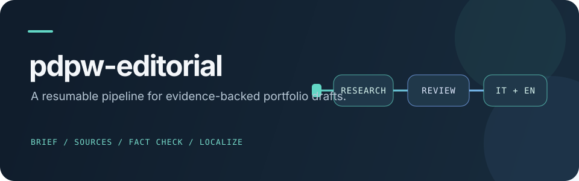

<p align="center">
  
</p>

# pdpw-editorial

A Python pipeline and Claude Code plugin for preparing evidence-based Italian and English portfolio article drafts for Wagtail via the PDPW MCP.

<p>
  
  
  
</p>

## 🧭 Overview

The project combines a deterministic Python CLI with editorial workflow files under `plugins/pdpw-editorial/`. Its eight-phase model covers briefing, source research, gap analysis, drafting, fact checking, editorial and SEO review, English localization, and QA/publishing decisions. Pipeline artifacts are stored per article in `posts/<stable_id>/`.

The CLI manages phase validation, hashes, resumable state, fact-check gates, payload preparation, and idempotent publish decisions. A live run creates Wagtail draft pages; publication remains a human action. Dry-run mode prepares the workflow without writing to PDPW.

The repository currently contains skill definitions for phases 1–4. The phase map and operating contract describe all eight phases.

## 🚀 Quick Start

```bash
uv sync
uv run python plugins/pdpw-editorial/scripts/pipeline.py --help
```

Create a pipeline state from a topic:

```bash
uv run python plugins/pdpw-editorial/scripts/pipeline.py slugify "OAuth 2.1 MCP server integration"
uv run python plugins/pdpw-editorial/scripts/pipeline.py init oauth-2-1-mcp-server-integration --dry-run
uv run python plugins/pdpw-editorial/scripts/pipeline.py status oauth-2-1-mcp-server-integration
```

The CLI prints JSON results. Run it from the repository root; article artifacts default to `posts/`.

## 🧱 Architecture

| Path | Purpose |
| --- | --- |
| `plugins/pdpw-editorial/scripts/pdpw_pipeline/` | Pipeline state, validation, policy, artifact, and publish logic |
| `plugins/pdpw-editorial/scripts/pipeline.py` | CLI entry point |
| `plugins/pdpw-editorial/skills/` | Editorial skill definitions currently present for phases 1–4 |
| `plugins/pdpw-editorial/schemas/` | JSON schemas for pipeline artifacts |
| `plugins/pdpw-editorial/knowledge/` | Editorial voice and source policies |
| `posts/` | Per-article pipeline artifacts |
| `tests/` | Pytest suite |
| `docs/specs/` | Design specification |

## 🛠️ Development

| Command | Purpose |
| --- | --- |
| `uv sync` | Install project and development dependencies from `uv.lock` |
| `uv run pytest` | Run the test suite |
| `uv run ruff check .` | Run Ruff lint checks |
| `uv run python plugins/pdpw-editorial/scripts/pipeline.py --help` | Show CLI commands and options |

The project targets Python `>=3.13,<3.14`. Runtime dependencies are `jsonschema` and `pyyaml`; development dependencies are `pytest` and `ruff`.

## 📚 Project documentation

- [Operating contract](plugins/pdpw-editorial/CONTRACT.md) — phase workflow, artifact rules, and publishing safeguards.
- [Design specification](docs/specs/2026-09-27-pdpw-editorial-design.md) — goals and data model.
- [Editorial policy](plugins/pdpw-editorial/knowledge/editorial-policy.md), [source policy](plugins/pdpw-editorial/knowledge/source-policy.md), and [voice guide](plugins/pdpw-editorial/knowledge/voice.md).
- [Evaluation notes](plugins/pdpw-editorial/evals/NOTES.md) — recorded skill evaluation results and limitations.
