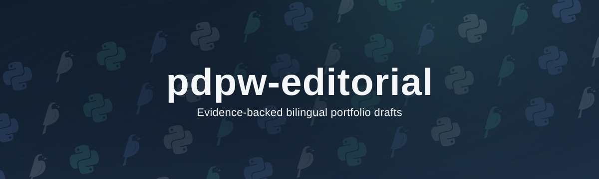

<h1 align="center">
  
</h1>

  
  
  

`pdpw-editorial` documents a proposed workflow for evidence-backed Italian and English portfolio drafts, ending in human-reviewed Wagtail drafts. The design specification is marked DRAFT.

Start with the [documentation index](docs/README.md) for the [design specification](docs/architecture/2026-09-27-pdpw-editorial-design.md) and [implementation plan](docs/development/2026-09-27-pdpw-editorial-implementation-plan.md).
